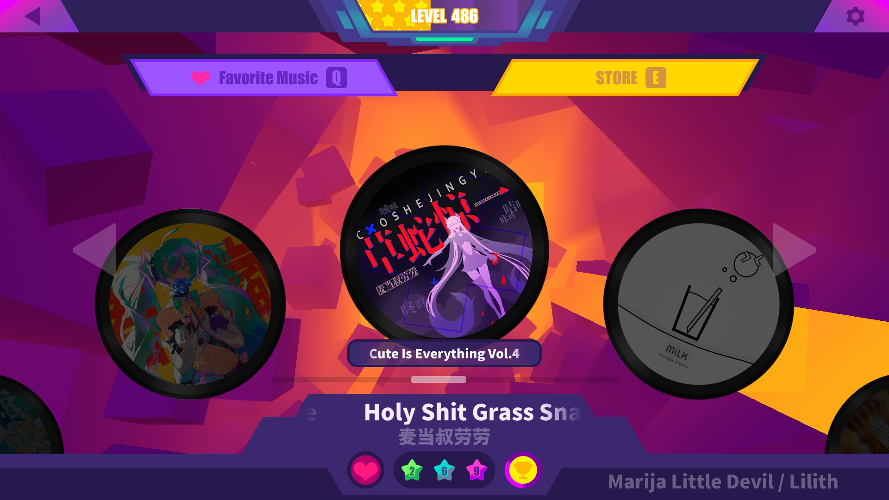
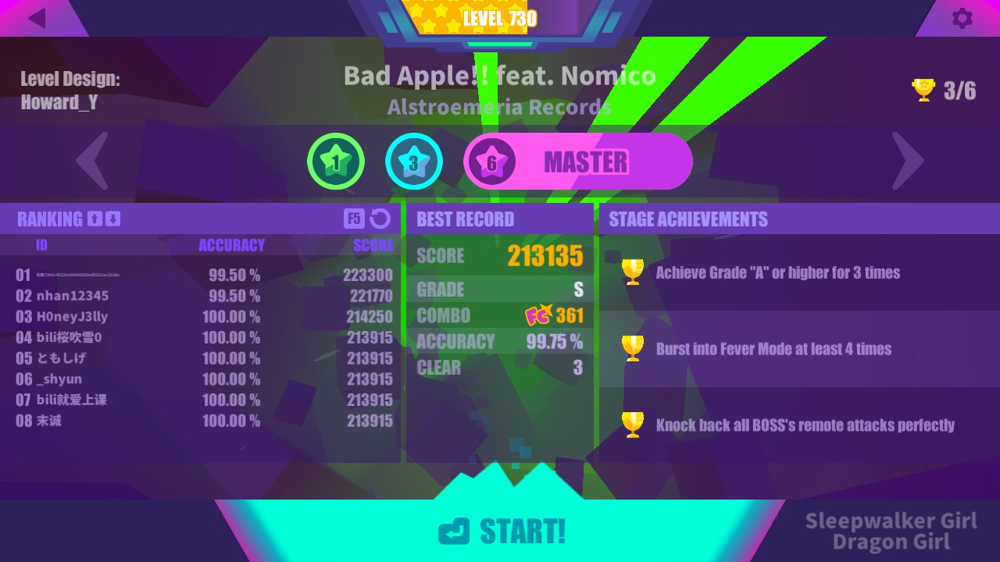

# CurrentCombination

Shows the current selected character and elfin in the song selection menu and the song view.

## Features
* Displays on the song select menu and on the selected son menu.
* Updates immediatly even when changing localization.
* Enable/disable the text from settings.

### Settings
Inside the MelonPreferences.cfg you can find two boolean options for the mod.
* showInSongsMenu: Controls whether the current combination is shown inside the songs menu.
* showInSongView: Controls whether the current combination is shown inside the selected song view.

## In-game screeshots
### Song menu

### Song view

